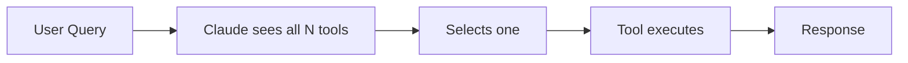
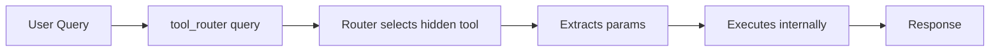
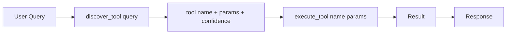
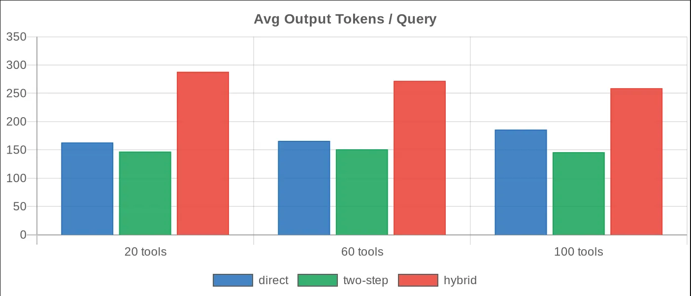
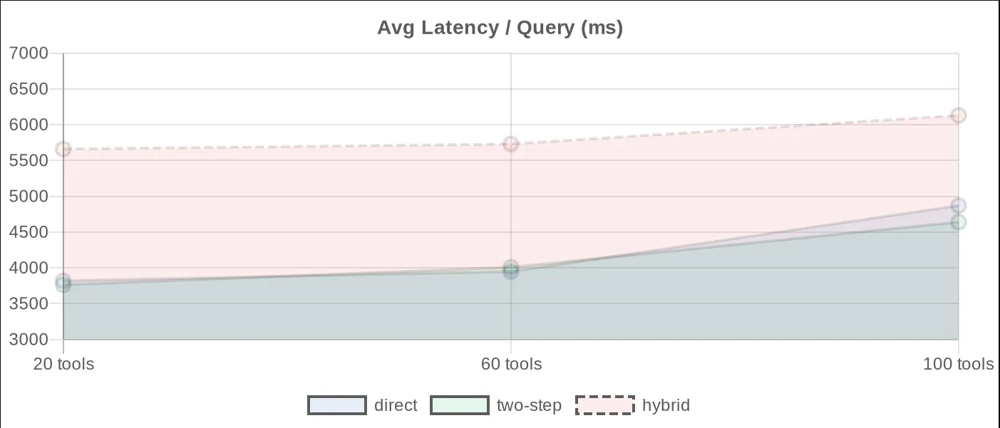
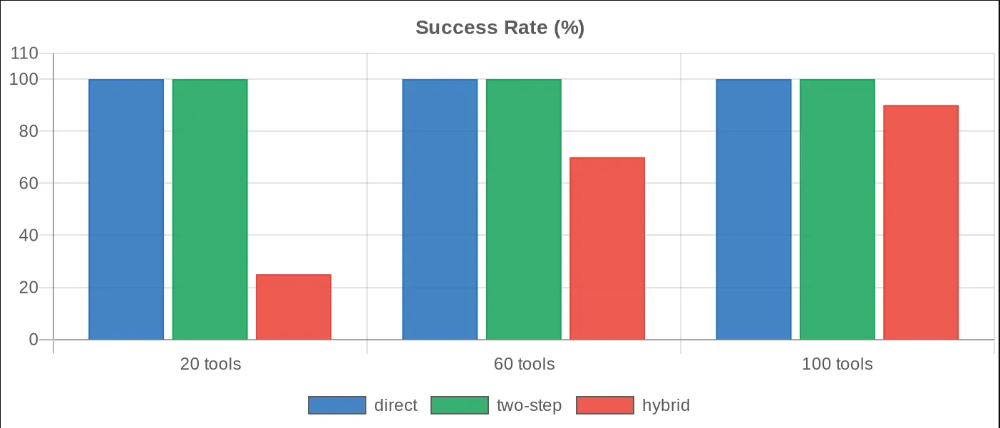

# MCP Tool Routing Benchmark

> **How do different tool-routing strategies scale as your MCP tool catalog grows from 20 to 100 tools?**
> We tested four architectures — measuring token usage, latency, and reliability at each scale.


---

## The Problem

When you connect an AI agent directly to a real company system, the first instinct is simple — expose every tool directly to the model. That works fine with 10 tools. But what happens at 60? At 100? At 500?

**Two things break down:**

1. **Context overhead** — every tool schema is serialized into the context window on every request, whether or not it is relevant to the current query.
2. **Semantic collision** — tools with similar names and overlapping descriptions cause the model to pick the wrong one. For example, when a user asks *"is postgres healthy?"*, which of these should it call?

```
get_server_health
get_service_health
get_database_status   ← correct
get_cluster_status
get_node_status
```

This is where **tool routing** becomes essential.

---

## Architecture Modes

| Mode | What Claude Sees | What Happens | Best For |
|------|-----------------|--------------|----------|
| `direct` | All N tools | Claude picks and calls the actual MCP tool | Small / stable catalogs |
| `router` | One `tool_router` tool | Router selects hidden tool, extracts params, executes, returns result | **Production at scale** |
| `two-step` | `discover_tool` + `execute_tool` | Discovery selects tool/params; execution calls the hidden tool | Debugging, tracing, observability |
| `hybrid` | Few direct tools + router fallback | Claude calls a visible tool or delegates to router | Experimental — needs careful design |

### How each mode flows

**Direct**


**One-call Router**


**Two-step Router**


> **Note on two-step:** The benchmark runner always forces `execute_tool` after `discover_tool`. Results reflect full end-to-end execution — not routing only. Two-step is directly comparable to `direct` and `router`.

---

## Benchmark Results

### At a Glance

| Metric | Value |
|--------|-------|
| Token reduction — router vs direct @ 100 tools | **−22.8%** |
| Latency reduction — router vs direct @ 100 tools | **−18.1%** |
| Failure rate — direct / router / two-step | **0% at all catalog sizes** |
| Hybrid failure rate @ 20 tools (worst run) | **75% failure** |

---

### Token Usage



### Latency



### Success Rate



> **Router excluded from execution charts** — it was designed to test tool-finding, not end-to-end execution pipelines. Full router numbers: 143 / 139 / 144 avg tokens · 4.20 / 4.24 / 3.98s avg latency · 20/20 success at all sizes.

---

### 20 Tools

| Architecture | Success | Avg Tokens | Avg Latency | vs Direct |
|:------------|:-------:|:----------:|:-----------:|:---------|
| `direct` | ✅ 20/20 | 163 | 3.82s | baseline |
| `router` | ✅ 20/20 | 143 | 4.20s | −12.3% tokens |
| `two-step` | ✅ 20/20 | 147 | 3.76s | −9.8% tokens |
| `hybrid` | ❌ 5/20 | 288 | 5.66s | +76.7% tokens, +48% time |

### 60 Tools

| Architecture | Success | Avg Tokens | Avg Latency | vs Direct |
|:------------|:-------:|:----------:|:-----------:|:---------|
| `direct` | ✅ 20/20 | 166 | 3.95s | baseline |
| `router` | ✅ 20/20 | 139 | 4.24s | −16.3% tokens |
| `two-step` | ✅ 20/20 | 151 | 4.01s | −9.3% tokens |
| `hybrid` | ⚠️ 14/20 | 272 | 5.73s | +63.9% tokens, +45% time |

### 100 Tools

| Architecture | Success | Avg Tokens | Avg Latency | vs Direct |
|:------------|:-------:|:----------:|:-----------:|:---------|
| `direct` | ✅ 20/20 | 186 | 4.87s | baseline |
| `router` | ✅ 20/20 | 144 | 3.98s | **−22.8% tokens, −18.1% time** |
| `two-step` | ✅ 20/20 | 146 | 4.64s | −21.5% tokens, −4.7% time |
| `hybrid` | ⚠️ 18/20 | 259 | 6.13s | +39.2% tokens, +25.9% time |

---

## Key Findings

### 1. Direct is a great starting point — not a destination

At 20 tools, `direct` is competitive with everything. Zero routing complexity, full transparency. But watch the token count creep: 163 → 166 → 186 as the catalog grows. That is tool-schema overhead paid silently on every request, before any reasoning happens.

### 2. Router is the production default at scale

At 100 tools the one-call router delivered:
- ✅ 20/20 success
- **−22.8%** token usage vs direct
- **−18.1%** latency vs direct

More importantly, the model-facing interface stays frozen at `tool_router(query)` regardless of what changes internally. New microservices, renamed endpoints, parameter updates — none of it touches the agent.

### 3. Two-step is your debugging and observability interface

Two-step keeps 20/20 success and 21.5% fewer tokens at 100 tools — so it is not a performance sacrifice. What it adds is a natural inspection point between discovery and execution:

```json
// discover_tool response
{
  "selected_tool": "get_payment_status",
  "params": { "payment_id": "PAY-7788" },
  "confidence": 0.88,
  "reason": "Query references a payment ID with PAY- prefix"
}
```

This is ideal for visual agent dashboards, audit trails, and debugging why an agent gave a wrong answer.

### 4. Hybrid needs a small, distinct direct-tool set

Hybrid failed on 75% of queries in its worst run. The cause: broad tools exposed directly (`get_server_health`, `get_recent_logs`) attract unrelated queries and create ambiguity with the router path.

```
# ❌ Dangerous hybrid direct set
get_server_health        # too general
get_recent_logs          # too general
get_vector_search_results

# ✅ Safe hybrid direct set
get_ticket_status        # specific, high-confidence
get_order_status         # specific, high-confidence
tool_router              # everything else
```

---

## Recommendation

```
Production default   →  router
Debug / trace mode   →  two-step
Small catalog (<30)  →  direct
Experimental         →  hybrid (with care)
```

Use `router` in production. Use `two-step` in development and staging where you need to understand what the agent decided and why. The two can run side-by-side — same internal tool registry, different external interface.

---

## Setup & Running the Benchmark

### Environment

```bash
export AWS_REGION=eu-central-1
export AWS_DEFAULT_REGION=eu-central-1
export BEDROCK_MODEL_ID="eu.anthropic.claude-sonnet-4-20250514-v1:0"
export BEDROCK_THINKING_ENABLED=true
export BEDROCK_THINKING_BUDGET_TOKENS=1024
```

### Run all architectures at 100 tools

```bash
export TOOL_COUNT=100
npm run build

rm -rf runs/direct-bedrock-100   && npm run bedrock:bench direct
rm -rf runs/router-bedrock-100   && npm run bedrock:bench router
rm -rf runs/two-step-bedrock-100 && npm run bedrock:bench two-step
rm -rf runs/hybrid-bedrock-100   && npm run bedrock:bench hybrid

npm run compare
cat output/combined-benchmark-report-100-tools.md
```

### Run at different catalog sizes

```bash
# 20 tools
export TOOL_COUNT=20 && npm run build && npm run bedrock:bench direct

# 60 tools
export TOOL_COUNT=60 && npm run build && npm run bedrock:bench router

# 100 tools
export TOOL_COUNT=100 && npm run build && npm run bedrock:bench two-step
```

### Project structure

```
src/
├── benchmarks/
│   ├── run-bedrock-mcp-benchmark.ts
│   └── compare-claude-benchmark-summaries.ts
├── lib/
│   ├── tool-registry.ts
│   ├── router.ts
│   ├── fake-tools.ts
│   └── bedrock-claude-client.ts
└── servers/
    ├── direct-tools-server.ts
    ├── semantic-router-server.ts
    ├── semantic-two-step-server.ts
    └── hybrid-server.ts
```

---

## Benchmark Methodology

- 20 identical prompts per architecture per run (weather lookups, stock prices, order checks, infrastructure queries, document searches)
- Extra tools in 60 and 100-tool runs are semantic distractors — they test routing quality under catalog pressure
- All runs use Claude Sonnet 4 on Amazon Bedrock via local MCP servers
- Metrics captured: success/failure, total tokens, avg tokens per query, total runtime, avg runtime per query, tool-call count, tool-call latency
- Router excluded from head-to-head execution tables — it tests tool-finding, not end-to-end execution pipelines